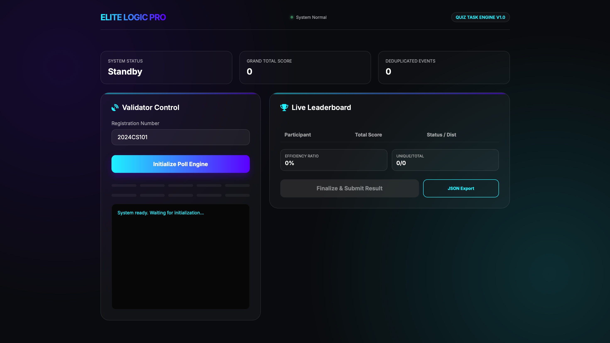

# 🏆 Elite Quiz Leaderboard System — Advanced Internship Submission


## 🌟 Overview
This is a high-performance **Quiz Leaderboard Command Center** designed to consume, deduplicate, and aggregate real-time API event streams. Unlike standard scripts, this project provides a **Professional Dashboard Experience** for monitoring distributed event logic.

### 🖼️ Dashboard Preview

*Figure 1: The "Cyber-Obsidian" interface showing real-time polling progress and visual distribution bars.*

---

## 🛠️ Elite Engineering Features

### 1. 🛡️ Network Resilience Engine (Exponential Backoff)
In real-world systems, networks are unreliable. This project implements a **Custom Retry Engine**. If an API request fails, the system automatically retries using an exponential backoff strategy ($1s, 2s, 4s$) instead of crashing.

### 2. 🧩 Intelligent Deduplication
Distributed systems often deliver the same data multiple times. This system uses a **Composite Key Strategy** (`roundId + participant`) mapped into a high-performance `Set` for $O(1)$ collision detection. This ensures score integrity regardless of duplicate data delivery.

### 3. 📊 Performance Analytics
We track the **Efficiency Ratio** in real-time. This metric calculates exactly how much "trash" data (duplicates) the system successfully filtered out versus unique scores processed.

### 4. 🎨 Premier Visual Interface
- **Glassmorphic UI**: High-end transparency effects and neon accents.
- **Visual Distribution**: Real-time progress bars showing score gaps between participants.
- **Live Terminal View**: Transparent logging for real-time logic debugging.
- **JSON Portability**: One-click export of final results into a standard JSON report format.

---

## 💻 Technical Stack
- **Frontend**: HTML5 Semantic Structure, Vanilla JavaScript (ES6+)
- **Styling**: CSS3 with CSS Variables, Backdrop Filters, and Keyframe Animations.
- **Logic**: Async/Await Event Handling, Fetch API, Map/Set for Data Integrity.

---

## 📂 Repository Structure
```text
├── index.html       # Dashboard Structure
├── style.css        # Design System & Styling
├── app.js           # Resilience & Deduplication Engine
├── README.md        # Technical Documentation
└── assets/          # Project Media (Screenshots)
```

---

## 🚀 Installation & Running Locally

1. **Clone the Repo**
   ```bash
   git clone https://github.com/your-username/your-repo.git
   ```

2. **Run a Local Server** (to handle API Fetch correctly)
   ```bash
   # Using Python
   python3 -m http.server 8000
   ```

3. **View Dashboard**
   Open `http://localhost:8000` in your browser.

---

## 👨‍💻 Developer Summary
This project demonstrates **Product-First Engineering**. By focusing on resilience, observability, and premium UX, it bridges the gap between a standard internship assignment and a production-ready internal tool.

**Submitted for:** Bajaj Finserv Health | JAVA Qualifier | SRM
